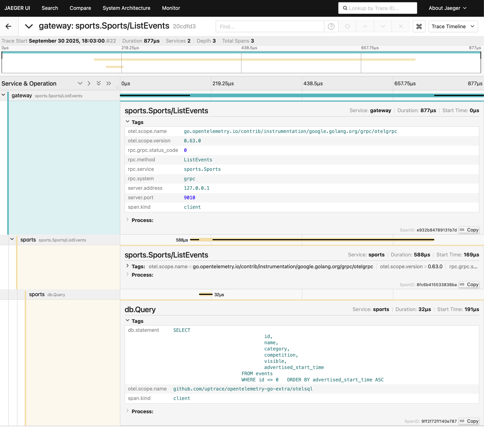

# Entain BE Technical Test

## Table of Contents

- [Why the initial setup was changed](#why-the-initial-setup-was-changed)
- [Technical tasks](#technical-tasks)
  - [Task 1](#task-1)
  - [Task 2](#task-2)
  - [Task 3](#task-3)
  - [Task 4](#task-4)
  - [Task 5](#task-5)
- [Requirements](#requirements)
- [API Gateway](#api-gateway)
  - [Running the API Gateway](#running-the-api-gateway)
- [Racing service](#racing-service)
  - [Running racing service](#running-racing-service)
  - [Calling racing service through API Gateway](#calling-racing-service-through-api-gateway)
  - [Listing races](#listing-races)
    - [Filtering races](#filtering-races)
    - [Ordering races](#ordering-races)
  - [Getting a specific race](#getting-a-specific-race)
- [Sports service](#sports-service)
  - [Importing (seeding) sports events data](#importing-seeding-sports-events-data)
  - [Running sports service](#running-sports-service)
  - [Calling sports service through API Gateway](#calling-sports-service-through-api-gateway)
  - [Listing sport events](#listing-sport-events)
    - [Filtering sport events](#filtering-sport-events)
    - [Ordering sport events](#ordering-sport-events)
  - [Getting a specific sport event](#getting-a-specific-sport-event)
- [OTEL Tracing](#otel-tracing)
- [Testing](#testing)
- [Code generation](#code-generation)
- [Development workflow](#development-workflow)
- [Cleaning up](#cleaning-up)

## Why the initial setup was changed

I felt that I should change the initial setup of the technical test for the
following reasons. I hope you would understand my decisions and below I will do
my best to back those decisions up.

1. The original setup was arranged through multiple Go modules. That did not
   allow to import `git.neds.sh/matty/entain/api` module into
   `git.neds.sh/matty/entain/racing` unless I started using [Go workspaces](https://go.dev/doc/tutorial/workspaces).
   Instead, I simplified those modules to subpackages within a single module to
   ease importing. All of the subpackages in the proposed layout should end up
   being separate modules (possibly even repositories) and should be versioned
   separately as well.

1. Dealing with the item 1 allowed placing `*.proto` files into a centralized
   location and not repeat those file in multiple folder running into the risk
   of content de-syncing. In my experience, defining API specs (which `*.proto`
   files are) in a centralized location is an effective way to communicate API
   changes and delineate responsibilities especially in a multi-team environment.

1. I changed existing `ListRaces` RPC from `POST` to `GET` HTTP method in
   `api/racing/racing.proto` file. I am pretty sure that there will be opinions
   arguing about potential growth of the filter complexity and that `POST`
   should be a good fit. I do think, however, that `GET` is the more appropriate
   choice here, as it better aligns with the semantics of retrieving data
   without side effects. `GET` requests can be cached, bookmarked, and shared
   more easily, which is beneficial for a listing operation. I do think that
   current complexity of the filter is manageable within the constraints of
   `GET` requests.

1. I converted command line flags to use environment variables instead. I think
   that environment variables are a more common way to configure services in
   production environments. They are easier to manage in containerized
   environments and orchestration systems like Kubernetes. I also believe that
   it is in line with the [12-factor app principles](https://12factor.net) which
   are widely adopted in the industry. The same goes for structural logging
   which is accomplished through `log/slog` package.

1. I replaced abstractions (interfaces) around database queries in `racing`
   package with concrete implementations. The benefits of using real database
   connection in tests outweigh the benefits of using abstractions in this case.
   The tests are more realistic and better reflect the actual behavior of the
   application when interacting with a real database. It also addresses issues
   like SQL syntax errors and schema mismatches that might not be caught when
   using mocks or stubs.

1. I replaced `tools.go` files with `tool` directive in `go.mod` file. This is a
   more modern and cleaner way to manage tool dependencies in Go projects. It
   keeps the `go.mod` file as the single source of truth for all dependencies,
   making it easier to manage and update them.

1. I did a bit of tidying up of the existing code, introducing more readable
   functions, comments and types. I introduced `cmd` folder which is canonical
   in Go project setup.

1. I introduced `Makefile` to deal with testing, code generation based on
   `*.proto` files, etc. Makefiles are one of the build managers out there, it
   might not be the best, but it is surely widely spread enough. I felt it would
   be better to have some building management rather than none.

## Technical tasks

### Task 1

> Add another filter to the existing RPC, so we can call `ListRaces` asking for
> races that are visible only

The changes related to this task can be traced at the branch
[`visible-only-races-filter`](https://github.com/danilvpetrov/entain/tree/visible-only-races-filter).
The commits on this branch should be merged into the `main` branch.

Status: ✅ Completed - The `visibleOnly` filter has been added to the `ListRaces`
RPC.

### Task 2

> We'd like to see the races returned, ordered by their `advertised_start_time`
> Bonus points if you allow the consumer to specify an ORDER/SORT-BY they might be after.

The changes related to this task can be traced at the branch
[`race-result-ordering`](https://github.com/danilvpetrov/entain/tree/race-result-ordering).
The commits on this branch should be merged into the `main` branch.

Status: ✅ Completed - The `orderBy` parameter has been added to the `ListRaces`
RPC to allow ordering by various fields.

### Task 3

> Our races require a new `status` field that is derived based on their
> `advertised_start_time`'s. The status is simply, `OPEN` or `CLOSED`. All races
> that have an `advertised_start_time` in the past should reflect `CLOSED`.

The changes related to this task can be traced at the branch
[`race-status`](https://github.com/danilvpetrov/entain/tree/race-status).
The commits on this branch should be merged into the `main` branch.

Status: ✅ Completed - The `status` field has been added and is automatically
computed based on the advertised start time.

### Task 4

> Introduce a new RPC, that allows us to fetch a single race by its ID.

The changes related to this task can be traced at the branch
[`get-race-rpc`](https://github.com/danilvpetrov/entain/tree/get-race-rpc).
The commits on this branch should be merged into the `main` branch.

Status: ✅ Completed - The `GetRace` RPC has been implemented to fetch individual
races by ID.

### Task 5

> Create a `sports` service that for sake of simplicity, implements a similar API to racing.

The changes related to this task can be traced at the branch
[`sports-service`](https://github.com/danilvpetrov/entain/tree/sports-service).
The commits on this branch should be merged into the `main` branch.

Status: ✅ Completed - The sports service has been implemented with similar
functionality to the racing service.

## Requirements

- `Go` 1.24+
- `protoc` Protocol Buffers compiler (see https://protobuf.dev/installation/ for installation instructions)
- `make` build automation tool
- `golangci-lint` (for linting, see https://golangci-lint.run/docs/welcome/install/ for installation instructions)
- `betteralign` (for code alignment, can be installed via `go install github.com/dkorunic/betteralign/cmd/betteralign@latest`)
- `docker` (for running OpenTelemetry Collector, see https://docs.docker.com/get-docker/ for installation instructions)

## API Gateway

API Gateway acts as a reverse proxy, routing requests from clients to the
appropriate microservices (racing and sports services). It handles tasks such as
request routing, composition, and protocol (HTTP<->gRPC) translation.

### Running the API Gateway

To run the API Gateway, use the following command in a separate terminal
window/tab:

```bash
make run-gateway
```

The following environment variables can be used to configure the gateway:

- `LISTEN_ADDR` - address to listen on (default: `localhost:8000`)
- `RACING_SERVICE_ADDR` - address of the racing service (default: `localhost:9000`)
- `SPORTS_SERVICE_ADDR` - address of the sports service (default: `localhost:9010`)
- `DEBUG` - enable debug logging (default: `false`)

## Racing service

Racing service is a microservice that provides racing-related data and
functionality. The Swagger OpenAPI definitions of the service calls can be found
[here](./api/racing/racing.swagger.yaml).

### Running racing service

To run the service, use the following command in a separate terminal window/tab:

```bash
make run-racing
```

The following environment variables can be used to configure the service:

- `LISTEN_ADDR` - address to listen on (default: `localhost:9000`)
- `RACING_DB_PATH` - path to the racing database (default: `racing.db`)
- `DEBUG` - enable debug logging (default: `false`)

### Calling racing service through API Gateway

Once the gateway and racing service are running, you can call the service using
`curl` or any HTTP client in a separate terminal window/tab. Provided that the
default address of the gateway is still `localhost:8000`, you can use the
following command:

```bash
curl -i -X GET http://localhost:8000/v1/races
```

### Listing races

You can use the `ListRaces` RPC to list all races. For example:

```bash
curl -i -X GET http://localhost:8000/v1/races
```

#### Filtering races

You can use `meetingId` query parameter to filter the races by meeting ID. You
can use this parameter multiple times to filter by multiple meeting IDs, for example:

```bash
curl -i -X GET "http://localhost:8000/v1/races?meetingId=1&meetingId=2"
```

You can also use `visibleOnly` query parameter to filter only visible races. For example:

```bash
curl -i -X GET "http://localhost:8000/v1/races?visibleOnly=true"
```

Please note that if `visibleOnly` is set to false or not set at all, both
visible and non-visible races will be returned.

#### Ordering races

You can use `orderBy` query parameter to order the races by different fields. The
possible values are:

- `ADVERTISED_START_TIME_ASC` - order by advertised start time in ascending order
- `ADVERTISED_START_TIME_DESC` - order by advertised start time in descending order
- `MEETING_ID_ASC` - order by meeting ID in ascending order
- `MEETING_ID_DESC` - order by meeting ID in descending order
- `NAME_ASC` - order by name in ascending order
- `NAME_DESC` - order by name in descending order
- `NUMBER_ASC` - order by number in ascending order
- `NUMBER_DESC` - order by number in descending order

You can use this parameter multiple times to order by multiple fields. The sequence
of the parameters defines the order of precedence. In the example below, the
races will be ordered first by advertised start time in ascending order, and then
by meeting ID in descending order.

```bash
curl -i -X GET "http://localhost:8000/v1/races?orderBy=ADVERTISED_START_TIME_ASC&orderBy=MEETING_ID_DESC"
```

Please note that if you specify conflicting ordering options (e.g.,
`ADVERTISED_START_TIME_ASC` and `ADVERTISED_START_TIME_DESC`), the service will
return an error.

### Getting a specific race

To get a specific race, you can use the `GetRace` RPC and specify the race ID at
the end of the URL. For example:

```bash
curl -i -X GET http://localhost:8000/v1/races/1
```

This will return the details of the race with ID 1.

## Sports service

Sports service is a microservice that provides sports-related data and
functionality. The Swagger OpenAPI definitions of the service calls can be found
[here](./api/sports/sports.swagger.yaml).

### Importing (seeding) sports events data

There is a sufficient data already collected to seed the sports service
database. The seed data is located in
[`sports/testdata/testdata.json`](./sports/testdata/testdata.json) file. All of
those data were fetched from Ladbrokes API at some point in time in the past and
now used to populate the sports database. To add more data on top of the
existing data, you can run the import command below.

```bash
make import-sports-events
```

This command fetches current in-play sports events from Ladbrokes API and adds
them to the existing records in
[`sports/testdata/testdata.json`](./sports/testdata/testdata.json) file.

### Running sports service

To run the service, use the following command in a separate terminal window/tab:

```bash
make run-sports
```

The following environment variables can be used to configure the service:

- `LISTEN_ADDR` - address to listen on (default: `localhost:9010`)
- `SPORTS_DB_PATH` - path to the sports database (default: `sports.db`)
- `DEBUG` - enable debug logging (default: `false`)

### Calling sports service through API Gateway

Once the gateway and sports service are running, you can call the service using
`curl` or any HTTP client in a separate terminal window/tab. Provided that the
default address of the gateway is still `localhost:8000`, you can use the
following command:

```bash
curl -i -X GET http://localhost:8000/v1/sports
```

### Listing sport events

You can use the `ListEvents` RPC to list all sport events. For example:

```bash
curl -i -X GET http://localhost:8000/v1/sports
```

#### Filtering sport events

You can use `category` query parameter to filter the events by category. You
can use this parameter multiple times to filter by multiple categories, for example:

```bash
curl -i -X GET "http://localhost:8000/v1/sports?category=AMERICAN_FOOTBALL&category=BASKETBALL"
```

The following categories are supported:

- `AMERICAN_FOOTBALL`
- `AUSTRALIAN_RULES`
- `BADMINTON`
- `BASEBALL`
- `BASKETBALL`
- `BOXING`
- `CRICKET`
- `CYCLING`
- `DARTS`
- `ESPORTS`
- `GAELIC_SPORTS`
- `GOLF`
- `HANDBALL`
- `ICE_HOCKEY`
- `MOTOR_SPORT`
- `NETBALL`
- `NOVELTY`
- `POLITICS`
- `POOL`
- `RUGBY_LEAGUE`
- `RUGBY_UNION`
- `SNOOKER`
- `SOCCER`
- `TABLE_TENNIS`
- `TENNIS`
- `MIXED_MARTIAL_ARTS`
- `VOLLEYBALL`

You can also use `visibleOnly` query parameter to filter only visible events. For example:

```bash
curl -i -X GET "http://localhost:8000/v1/sports?visibleOnly=true"
```

Please note that if `visibleOnly` is set to false or not set at all, both
visible and non-visible sport events will be returned.

#### Ordering sport events

You can use `orderBy` query parameter to order the sport events by different fields. The
possible values are:

- `ADVERTISED_START_TIME_ASC` - order by advertised start time in ascending order
- `ADVERTISED_START_TIME_DESC` - order by advertised start time in descending order
- `NAME_ASC` - order by name in ascending order
- `NAME_DESC` - order by name in descending order
- `COMPETITION_ASC` - order by competition in ascending order
- `COMPETITION_DESC` - order by competition in descending order

You can use this parameter multiple times to order by multiple fields. The sequence
of the parameters defines the order of precedence. In the example below, the
sport events will be ordered first by advertised start time in ascending order, and then
by competition in descending order.

```bash
curl -i -X GET "http://localhost:8000/v1/sports?orderBy=ADVERTISED_START_TIME_ASC&orderBy=COMPETITION_DESC"
```

Please note that if you specify conflicting ordering options (e.g.,
`ADVERTISED_START_TIME_ASC` and `ADVERTISED_START_TIME_DESC`), the service will
return an error.

### Getting a specific sport event

To get a specific sport event, you can use the `GetEvent` RPC and specify the event ID at
the end of the URL. For example:

```bash
curl -i -X GET http://localhost:8000/v1/sports/1
```

This will return the details of the sport event with ID 1.

## OTEL Tracing

API gateway, racing, and sports services are instrumented with OpenTelemetry
(OTEL) for distributed tracing and better observability. The services are
configured to export traces to a OTEL Collector instance using the OTLP protocol
over gRPC. [Jaeger](https://www.jaegertracing.io) is used both as a OTEL
Collector and as a frontend for trace visualization. Jaeger starts in a Docker
container automatically any time you run any of the services through the
`Makefile` targets `make run-gateway`, `make run-racing`, or `make run-sports`.
Jaeger UI is accessible at [http://localhost:16686](http://localhost:16686).

Below is a screenshot of Jaeger UI showing traces of a sample request:



## Testing

To run unit tests of all services, use the following command:

```bash
make test
```

## Code generation

To generate code from `*.proto` files, use the following command:

```bash
make generate
```

## Development workflow

For a complete pre-commit workflow (code generation, testing, and linting), use:

```bash
make precommit
```

This command runs code generation, tests, and applies code formatting and linting.
This command requires `golangci-lint` and `betteralign` tools to be installed.

## Cleaning up

To clean up build artifacts and Docker containers involved in the project, use:

```bash
make clean
```
